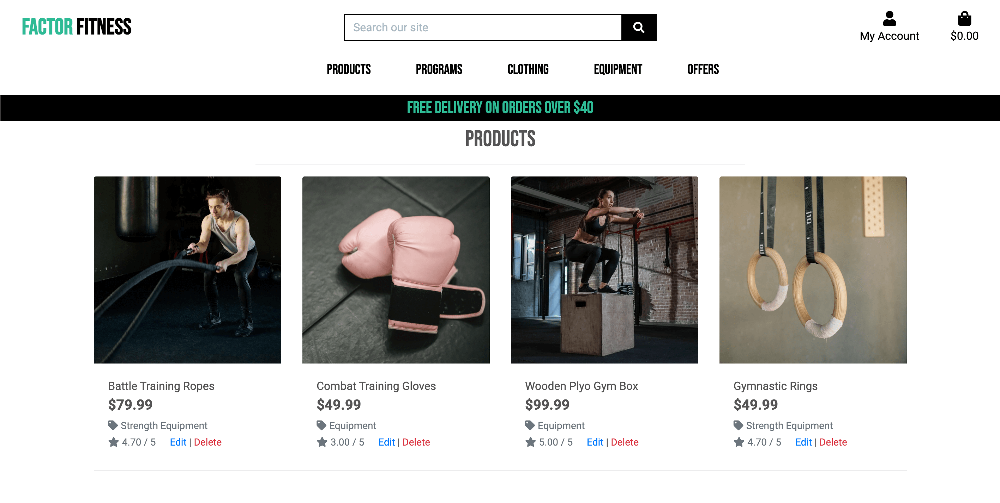

# FACTOR FITNESS


Visit the deployed site: [FACTOR FITNESS](https://factorfitness.herokuapp.com/) 

Factor Fitness is a fictional e-commerce store that specialises in strength training programs, gym equipment and apparel. 

This project was done as part of my Diploma by Code Institute in Full Stack Web Application Development. The objective for this milestone project was to plan, design and develop a project with all the functionalities to work as an actual e-commerce website.

At present the site is set up as a proof of concept, it allows users to create accounts, verify email addresses and place orders with a Stripe testing API checkout. 
Superusers are also able to log in and access the product management sections to add, delete or edit current products.

In its current form the site has many features missing that I would like to add in the future. I have detailed out these possible features later on in this README file.

---

## Contents 

* [User Experience](#User-Experience) 
* [User Stories](#User-Stories) 
* [Design](#Design) 
* [Colour Scheme](#Colour-Scheme) 
* [Typography](#Typography) 
* [Wireframes](#Wireframes) 
* [Database Schema](#Database-Schema)
* [Development Build Process](#Development-Build-Process)
* [Features](#Features) 
* [Pages](#Pages)
* [Future Development](#Future-Development) 
* [Accessibility](#Accessibility) 
* [Technologies Used](#Technologies-Used) 
* [Deployment](#Deployment)
* [Testing](#Testing) 
* [Credits](#Credits)

---

## User Experience 

### User Stories 

#### First time Visitor Goals 

* I want the site to be clear so that I immediately know what the site is intended for upon entering.
* I want to be able to easily find and purchase products.
* I want the e-commerce store to work well on all kinds of devices like mobile phones, tablets and desktops.
* I want to easily navigate the site by using the navigation menu.
* I want an easy way to search and sort products that are relevant to me.
* I want to be able to securely purchase a product with feedback of where I am in the process and the current status of that purchase.
* I want the site to be visually appealing and easy to read.
* I want to be able to register as a returning user to save my details for future orders.
* I want to be able to get in contact via social media so that I can follow and contact the team.
* I want to be able to add a product to the shopping bag and view the total value of the order.
* I want to view product details and images so I can see the product closer up and in more detail.
* I want to be able to update and delete products in the shopping bag to be in full control of the purchase.
* I want to view my order details to be able to confirm everything before final purchase.
* I want a clear indication of how to pay as well as an easy and secure method to pay for products with my card details.
* I want to receive appropriate feedback of the order success or failure to ensure the purchase has gone through.

#### Returning Visitor Goals

* To be able to log back into the site with my created username, email and password.
* To view my profile page to see my order history.
* To be able to log in and view, edit, add, delete my personal info.

#### Frequent Visitor Goals

* When clicking on social media links I want the page to open in a separate browser tab.
* I want to be able to easily and quickly see any new products or offers.

#### Admin User Goals

* I want to be able to view, search, edit and delete products.
* I want to be able to log into the product management section so I can add products to the database.

---

## Design

### Colour Scheme

I wanted to keep the colour scheme clean, simple and minimal to give a modern fitness gym feeling throughout. 

The backgrounds are kept to black and white to maintain a clean simple interface so that the users focus is mainly on the products on offer.

I used green as accent colours to contrast well against the white and black backgrounds and card sections to give a pop of colour when wanting to get the users attention. 

The red was only used on the delete buttons and warnings so that these would stand out and that the user noticed them. 

I wanted to make sure that the contrast of the colours was very well defined throughout the site, ensuring that the colour spectrum would work well for users with colour blindness.  

<br>

 
#

### Typography

Roboto font was used throughout the site as the base font.

This font works well for the site design as it is modern and easy to read. 


Bebas Neue font was used for the logo and for headings to give a bold impactful impression. 


Bebas Neue font as used for the main logo design. 


#

### Wireframes

Wireframes were created using Balsamiq software for desktop, mobile and tablet.


#

### Database Schema 


#

### Development Build Process

The build process of the site was completed in small incremental steps. 
This can be observed in the git commits catalogued within the Github repository that can be found here:
[Repository Commits](https://github.com/develosi/factor_fitness/commits/main)

Testing was carried out during the build, all testing documentation can be found at: [TESTING.md](TESTING.md)
#

### Features

The Website is made up of multiple applications, each with its own content template page or multiple template pages. Each application uses content from the base template that includes the header and footer sections.

Toast messages are also used throughout the site to give the user important information when needed. 

* Home Page
* Sign Up Page
* Verify Your Email Page
* Confirm Your Email Address Page
* Login Page 
* Profile Page
* Products Page
* Product Details Page
* Shopping Bag Page 
* Checkout Page
* Checkout Success Page
* Add a Product Page 
* Edit a Product Page
* Product Edit and Delete Sections
* Log Out Confirmation Page
#

### Pages 

All Pages on the site are responsive and have a favicon of the FACTOR FITNESS FF Logo:

 

#### Base Template 

All pages throughout the website have these base template sections on them. The content for these sections is taken from the Base Template HTML page. 


#### Toast Messages

Toast messages are also used throughout the site. 


#### Home Page

The Home page welcomes new users to the site and what it offers.  

Users are immediately invited to the shop section by clicking on the shop now button.


#### Sign Up Page

The user can register for an account. 


#### Verify Email Message Page

The user is informed to check their email to verify their account. 


#### Confirm Email Page

Once a user as gone to the verify email web link they are greeted with a message to click on the confirm email button. 


#### Log In Page 

The user can sign into their account. 


#### Profile Page

The user can access the profile page. 

The user can see any previous orders and add personal shipping details ready to be used on future orders. 


#### Products Page

The user can view current available products in the store and filter them using the dropdown menus at the top. 

Users can also search the entire site for a particular product using the search bar at the top nav section.


#### Product Details Page

The user can see further details of a product on the details page. This includes pricing, review scores and category. 

Quantities of the product can be added or adjusted off and then the user can add these to the shopping bag.  


#### Shopping Bag Page

The user can view all current selected products and adjust quantities if needed by changing the amount and clicking update. 

Users can also delete the product from the shopping bag by clicking on the delete button. 


#### Checkout Page

Users can see a summery of the products they have ordered and see the required input fields they need to complete for the shipping details. 

At the bottom of the shipping details section the user is invited to enter card details for payment. This is linked to the Stripe testing API.


#### Checkout Success Page

If the payment has successfully gone through then the user is greeted with a thank you message and summery of their order. 

A confirmation email will also be sent to the users email address. 


#### Add A Product Page

If the superuser 'admin' is logged in they can add products to the database using the product management section. 

The product management section is accessed through the 'My Account' dropdown menu.


#### Edit A Product Page

If the superuser 'admin' is logged in they can edit a product by clicking on the 'edit' button on any product page. 

The Edit A Product page allows a superuser to update all of the details relating to the product including the image used. 


#### Product Edit & Delete Section

If the superuser 'admin' is logged in they can edit or delete a product by clicking on the 'edit' or 'delete' buttons on any product page. 

Please note that no defensive programming has been set up yet for the deletion of products so superusers are given no warning before final deletion. 



#### Log Out Confirmation Page 

A user that is logged in can confirm they have logged out. 

For the purpose of this website I used the terminology of 'signed in' and 'signed out' as I felt it fitted the user experience better. 


#### Future Development

In future development and implementations I would like to add the following:

* Fix the nav bar for mobile view so that the logo fits within the top nav section.
* Have a contact section where the user can contact the sales team with any questions or even have a live chat option.
* Add more products to the site as at the moment there is very few. 
* Update the product details page for mobile view as the current layout doesn't fit well on a small screen. 
* Add social media login options for users signing up for the first time so it is easier and faster. 
* Add a video background for the main home index page to add a more engaging design for new users. 
* Add more design to the emails that get sent out to users so the design fits the theme of the website.
* Add more features to the profile page so that a user can track delivery of shipments.
* Add the ability for users to change passwords and profile names, not just the shipping address in the profile section.
* Give users the ability to review and give feedback scores to products within the profile section.
* Update shopping bag layout for mobile view as it currently doesn't fit well on small screens.  
* Show that the payments are processed by Stripe with branding at checkout to give confidence to the user paying.
* Add more features to the product management section as at present only new products can be added on this page. 
* Add more defensive programming throughout the site such as when superusers can delete products on the products page.
#

### Accessibility

I have been mindful to ensure that the site is as accessible as possible. The areas I have focused on are:

* Using semantic HTML with alt and aria attributes as much as possible.
* Using wording rather than an icon when an important action is required on a button.
* Choosing a simple easy to read font for the site with a bold style where needed.
* Ensuring that there is a strong colour contrast throughout the site so it easy to read.
* Extensive A11y and colour blindness accessibility testing carried out, results of all testing can be found at: [TESTING.md](TESTING.md).
#

### Defensive Programming

I would like to have spent more time developing the defensive programming features throughout the site. 
At present when a superuser wants to delete a product no warning alert appears for them to double confirm they are sure they want to delete it. 

At present whenever there is an important action to be completed by a user I have coloured it in red and made as bold as possible. 

In the future I hope to develop out the site further and add more defensive programming features throughout. 

---

## Technologies Used

### Languages Used

HTML, CSS, Javascript, Python

### Frameworks, Libraries & Programs Used

* [PostgreSQL](https://www.postgresql.org/) - Relational database used.

* [Django](https://www.djangoproject.com/) - Open-source web framework, used as the main framework for the site.

* [Bootstrap](https://getbootstrap.com/) - Responsive library resource using css and javascript components.

* [Google Fonts](https://fonts.google.com/) - library of fonts used hosted on Google CDN

* [SQLite](https://www.sqlite.org/index.html) - Django built-in database used as the database in development mode.

* [JSON Formatter](https://jsonformatter.org/) - JSON format testing tool used to confirm JSON files.

* [IMG BOX](https://imgbox.com/) - Used to host images of products outside of AWS cloud.

* [Heroku](https://www.heroku.com/) - Cloud platform used for deploying the website.

* [AWS](https://aws.amazon.com/) - Amazon Web Services used for hosting static files and images for the site.

* [Stripe](https://stripe.com/en-gb) - Used for testing credit and debit card payments.

* [Pip](https://pypi.org/project/pip/) - Tool for installing python packages.

* [Balsamiq](https://balsamiq.com/) - Used to create wireframes.

* [Github](https://github.com/) - For version control, save and store the files and deployment of site.

* [Visual Studio Code](https://code.visualstudio.com/) - Integrated development environment.

* [Font Awesome](https://fontawesome.com/) - For the icons on the site.

* [Google Chrome Dev Tools](https://developer.chrome.com/docs/devtools/) - Testing features, checking responsiveness and styling.

* [Tiny PNG](https://tinypng.com/) To compress images.

* [Canva](https://www.canva.com/) To resize images and create the logo.

* [Favicon.io](https://favicon.io/) To create the favicon.

* [Am I Responsive?](http://ami.responsivedesign.is/) - To show the website run on a range of devices.

* [Techsini](https://techsini.com/multi-mockup/index.php) - Used to create mock up images of site on devices.

* [Coolers](https://coolors.co/) - Colour scheme creation tool.

* [Web Disability Simulator](https://chrome.google.com/webstore/detail/web-disability-simulator/olioanlbgbpmdlgjnnampnnlohigkjla?hl=en) - A Google chrome extension to help check for accessibility issues.

* [Pexels](https://www.pexels.com/) - Stock images used throughout the site. Commercial free.

---

## Deployment

This project uses GitHub for version control and Heroku to deploy the site into production. Heroku Postgres is used for the database. [AWS](https://aws.amazon.com/), which is a cloud-based platform, is used to store static files and images.

To deploy please follow these steps:

### To Clone The Project
From the application's repository, click the "code" button and download the zip file of the repository. Alternatively, you can clone the repository using the following line in your terminal: 
```
git clone https://github.com/develosi/factor_fitness.git
```

#### To Install Required Software
While you are still in the terminal, type pip3 install -r requirements.txt, this will install all the required software to run the project:
```
pip3 install -r requirements.txt
```

#### Setup Environment For Variables
You now need to set up the database with environment variables. Create a file titled env.py and make sure it is placed in the main file structure. You can also add these in your workspace variable section. 

Option 1: env.py file:
```
 os.environ.setdefault('SECRET_KEY', '<your_variable_here>')
 os.environ.setdefault('DEVELOPMENT', 'True')
 os.environ.setdefault('STRIPE_PUBLIC_KEY', '<your_variable_here>')
 os.environ.setdefault('STRIPE_SECRET_KEY', '<your_variable_here>')
 os.environ.setdefault('STRIPE_WH_SECRET_CH', '<your_variable_here>')
 os.environ.setdefault('STRIPE_WH_SECRET_SUB', '<your_variable_here>')
 ```
- In ` settings.py`  add:
```
if os.path.exists("env.py"):
    import env
```
-  Add your env.py file to `.gitignore`, before pushing your changes.

Option 2: Workspace Variables:
```
KEY = 'SECRET_KEY', VALUE = '<your_variable_here>'
KEY = 'DEVELOPMENT', VALUE = 'True'
KEY = 'STRIPE_PUBLIC_KEY', VALUE = '<your_variable_here>'
KEY = 'STRIPE_SECRET_KEY', VALUE = '<your_variable_here>'
KEY = 'STRIPE_WH_SECRET_CH', VALUE = '<your_variable_here>'
KEY = 'STRIPE_WH_SECRET_SUB', VALUE = '<your_variable_here>'
KEY = 'AWS_ACCESS_KEY_ID', VALUE: '<your_variable_here>'
KEY = 'AWS_SECRET_ACCESS_KEY', VALUE: '<your_variable_here>'
KEY = 'USE_AWS', VALUE: 'True'
 ```

- In ` settings.py`  add:
 ```
 SECRET_KEY = os.environ.get('SECRET_KEY', '')
 ```

#### DEBUG Settings
```
DEBUG = 'DEVELOPMENT' in os.environ
```

### Heroku Deployment
- Go to the [Heroku](https://www.heroku.com/) website. Register for an account and click on "Create a new app".
- Setup a Heroku app within the Heroku dashboard - Type in the app name and select region then click on create app.
- In Heroku, in your app, click on "GitHub" to connect to your repository. Type in the repository name as on GitHub. Click on "Connect".
- Search for your repo (or sign in and connect GitHub account) and select this.
- Then click "Hide Config Vars" in Heroku.
- Go to the resources tab and search for Heroku Postgres. Choose the “hobby dev - free” option and submit the order form.
- On the `settings.py file`, you will need to comment out the 'SQLite and Postgres databases' section and uncomment the 'PostgreSQL Database' section. (this is temporary, nothing should be pushed/committed yet).
- Add the database URL from Heroku & migrate your models to the PostgreSQL database with: 
    ```
    python3 manage.py migrate
    ```
- Create a superuser with the following command, and fill in the required information:
    ```
    python3 manage.py createsuperuser
    ```
- In the `settings.py` file, you can now delete the 'PostgreSQL Database' section and uncomment the 'SQLite and PostgreSQL Databases' section. This means that either database can now be used interchangeably.
- Install gunicorn and freeze that to the requirements file with the following commands:
    ```
    pip3 install gunicorn
    pip3 freeze --local > requirements.txt
    ```
- Create a Procfile and inside, add the following:
    ```
    web: gunicorn factorfitness.wsgi:application
- In `settings.py`, use an if statement so that when the app runs on Heroku, you will connect to Postgres, and otherwise, it will connect to sqlite3, like so:
    ```
    if 'DATABASE_URL' in os.environ:
        DATABASES = {
            'default': dj_database_url.parse(os.environ.get('DATABASE_URL'))
        }
    else:
        DATABASES = {
            'default': {
                'ENGINE': 'django.db.backends.sqlite3',
                'NAME': BASE_DIR / 'db.sqlite3',
            }
        }
    ```
- Copy the variables from the variable environment one by one into the heroku config vars. They should be:
   ```
    KEY: 'SECRET_KEY', VALUE: “your_variable_here”
    KEY: 'DEVELOPMENT', VALUE: "True"
    KEY: 'STRIPE_PUBLIC_KEY', VALUE: "your_variable_here"
    KEY: 'STRIPE_SECRET_KEY', VALUE: "your_variable_here"
    KEY: 'STRIPE_WH_SECRET_CH', VALUE: "your_variable_here"
    KEY: 'STRIPE_WH_SECRET_SUB', VALUE: "your_variable_here"
    KEY: AWS_ACCESS_KEY_ID, VALUE: "AWS access key ID"
    KEY: AWS_SECRET_ACCESS_KEY, VALUE: "AWS secret access key"
    KEY: USE_AWS, VALUE: "True"
    ```
- Login to Heroku in the CLI and temporarily disable collectstatic, with the following command:
    ```
    heroku config:set DISABLE_COLLECTSTATIC=1 --app factorfitness
    ```
- Add your Heroku app and local host to allowed hosts in `settings.py.`
- Push to Github, and then to Heroku master. 
- In Heroku, go to the 'Deploy' tab. In the section 'Deployment Method' click on 'Github - Connect to Github'. Make sure your Github profile is displayed. Add the repository name and click on 'Search'. After Heroku has found the repository, click on 'Connect'. This will connect your Heroku app to your GitHub repository. Click 'Enable automatic deploys'. Your code will automatically be deployed to Heroku as well. 

### AWS (Amazon Web Services)
Create an account with [AWS](www.aws.amazon.com), follow the steps and sign in. 
- Go to the AWS management console and go to the S3 service. There, create a new bucket. Uncheck 'block all public access' and acknowledge that the bucket will be public.
- Go to the buckets properties, and turn on static website hosting. Select 'Use this bucket to host a website', and fill in index.html and error.html, then click 'save'.
- Go to the permissions tab, and go to CORS configuration. Paste in a CORS configuration:
```
[
  {
      "AllowedHeaders": [
          "Authorization"
      ],
      "AllowedMethods": [
          "GET"
      ],
      "AllowedOrigins": [
          "*"
      ],
      "ExposeHeaders": []
  }
]
```
- Go to the Bucket policy tab and click 'policy generator', to create a policy. Choose 'S3 bucket policy', allow all principals by typing a star. From the action dropdown menu select 'GetObject'. Copy the ARN and paste it into the ARN box. Then click 'add statement' and then click 'generate policy'. Copy the policy into the bucket policy editor. Add a slash star onto the end of the resource key. Click 'save'. 
- Go to access control list tab, under public access, click on 'Everyone', select 'List Objects'. Then click 'save'. 
- Go to IAM (from services menu), click on 'groups' and create a new user group. Give the group a group name (example: 'manage-factorfitness'). Then click 'create group'. 
- Click 'policies' in the dashboard, and then click 'create policy'. Go to the JSON tab. Click 'import managed policy'. Import 'AmazonS3FullAccess'. Get the bucket ARN from the bucket policy page in S3, and paste that in after 'Resource', as a list (first the ARN, then also the ARN with a slash and star). Click 'next tags' and then 'next review'. Give it a name and description. Click 'create policy'. 
- Go to 'groups'. Click the manage-factorfitness group. Go to 'permissions'. Click 'attach policy'. Select the policy you just created. Click 'add permissions' and then 'Attach policy'.
- Go to 'users'. Click 'add user'. As username write 'factorfitness-staticfiles-user. Give programmatic access. Click 'next'. Add the user to the group. Click through to the end. Download the .csv file. 

### Connecting DJANGO to AWS S3 and Stripe
- Go back to your IDE. Install boto3 and Django storages, and freeze them to the requirement file with the following commands:
    ```
    pip3 install boto3
    pip3 install django-storages
    pip3 freeze > requirements.txt
    ```
- Add 'storages' to the installed apps in the settings.py file.
- Add the following if statement:
    ```
    if 'USE_AWS' in os.environ:
        AWS_STORAGE_BUCKET_NAME = 'factorfitness'
        AWS_S3_REGION_NAME = 'eu-west-2'
        AWS_ACCESS_KEY_ID = os.environ.get('AWS_ACCESS_KEY_ID')
        AWS_SECRET_ACCESS_KEY = os.environ.get('AWS_SECRET_ACCESS_KEY')
        AWS_S3_CUSTOM_DOMAIN = f'{AWS_STORAGE_BUCKET_NAME}.s3.amazonaws.com'
    ```
- On Heroku, add the AWS keys to the Config Variables (they can be found in the csv file you downloaded earlier). Also, add USE_AWS and set it to True. 
- Remove the DISABLE_COLLECTSTATIC from the variables. 
- In your IDE, create a file called custom_storages.py and add:
    ```
    from django.conf import settings
    from storages.backends.s3boto3 import S#Boto3Storage

    class StaticStorage(S3Boto3Storage):
        location = settings.STATICFILES_LOCATION


    class MediaStorage(S3Boto3Storage):
        location = settings.MEDIAFILES_LOCATION 
    ```
- To the before mentioned if statement from above, in settings.py, also add:
    ```
        STATICFILES_STORAGE = 'custom_storages.StaticStorage'
        STATICFILES_LOCATION = 'static'
        DEFAULT_FILE_STORAGE = 'custom_storages.MediaStorage'
        MEDIAFILES_LOCATION = 'media'

        STATIC_URL = f'https://{AWS_S3_CUSTOM_DOMAIN}/{STATICFILES_LOCATION}/'
        MEDIA_URL = f'https://{AWS_S3_CUSTOM_DOMAIN}/{MEDIAFILES_LOCATION}/'
    ```
- Add, commit and push these changes. If you now go to the bucket, you will see all the static files. 
- Go to your bucket and add a new folder called media. Inside it, click 'upload' and then 'add files'. Then select all the images you'd like to use. Click 'next'. Under 'manage public permissions', select 'grant public read access'.
- On Stripe, add a new webhook endpoint, with the URL of your Heroku app, followed by 
```/checkout/wh/```. Select 'receive all events' and click 'add endpoint'.
#

## Testing

Please refer to [TESTING.md](TESTING.md) file for all testing completed.
#

## Credits

### Code Used

I used the code from the Code Institute modules on the Boutique Ado project as a starting point and reference for the main structure of the website. 

### Content

All content for the site, such as the product descriptions were written by myself.

### Media

Logo was designed by myself using Canva design tools.

All images used on the site are free to use for non commercial use and sourced from [Pexels](https://www.pexels.com/)

### Acknowledgments

I would like to acknowledge the following people:

* My Code Institute Class Teacher.

* My fellow class-mates  - For sharing all their struggles and accomplishments along the way with tackling this Milestone project.

* The Code Institute Slack channel - Thanks to everyone that took the time to share their tips and advice.
#