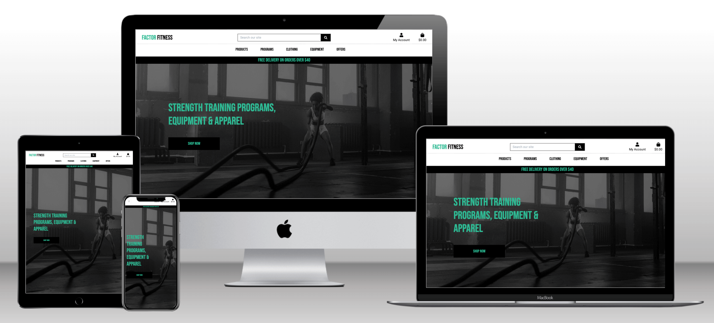

# FACTOR FITNESS



Visit the deployed site: [FACTOR FITNESS](https://factorfitness.herokuapp.com/) 

Factor Fitness is a fictional e-commerce store that specialises in strength training programs, gym equipment and apparel. 

This project was done as part of my Diploma by Code Institute in Full Stack Web Application Development. The objective for this milestone project was to plan, design and develop a project with all the functionalities to work as an actual e-commerce website.

At present the site is set up as a proof of concept, it allows users to create accounts, verify email addresses and place orders with a Stripe testing API checkout. 
Superusers are also able to log in and access the product management sections to add, delete or edit current products.

In its current form the site has many features missing that I would like to add in the future. I have detailed out these possible features later on in this README file.

---

## Contents 

* [User Experience](#User-Experience) 
* [User Stories](#User-Stories) 
* [Design](#Design) 
* [Colour Scheme](#Colour-Scheme) 
* [Typography](#Typography) 
* [Wireframes](#Wireframes) 
* [Database Schema](#Database-Schema)
* [Development Build Process](#Development-Build-Process)
* [Features](#Features) 
* [Pages](#Pages)
* [Future Development](#Future-Development) 
* [Accessibility](#Accessibility) 
* [Technologies Used](#Technologies-Used) 
* [Deployment](#Deployment)
* [How to Fork](#How-to-Fork) 
* [How to Clone](#How-to-Clone)
* [Testing](#Testing) 
* [Credits](#Credits)

---

## User Experience 

### User Stories 

#### First time Visitor Goals 

* The main purpose of the site is to be clear so that I immediately know what the site is intended for upon entering.
* View featured products on the website.
* I want to be able to easily purchase products and securely.
* The e-commerce store has to work well on all kinds of devices like mobile phones, tablets and desktops.
* Easy to navigate by using the navigation menu.
* Easy way to search and sort products that are relevant to me.
* I want to be able to successfully & securely purchase a product with feedback of where I am in the process and the current status of the purchase.
* To be met with a visually appealing and easy to read layout.
* To be able to register as a returning user to save my details for future orders.
* To be able to get in contact via social media so that I can follow and contact the team.
* To be able to add a product to the shopping bag and view the total of the order at any time to control my budget.
* To view product details and images so I can see the product closer up and in more detail.
* To be able to update and delete products in the basket to be in full control of the purchase.
* To view order details to be able to confirm everything before final purchase.
* A clear indication of how to pay as well as an easy and secure method to pay for products with card details.
* To receive appropriate feedback of order success or failure to ensure purchase has gone through.

#### Returning Visitor Goals

* To be able to log back into the site with my created username, email and password.
* To be able to reset password in the event I forget it
* To view my profile page to see my order history and also view, edit, add, delete my personal info.
* To be able to log out of my account.

#### Frequent Visitor Goals

* When clicking on links (resource and social media links), expect the page to open in a separate browser.

#### Admin User Goals

* View, add, edit, search, delete products.
* To have the ability to log in to an admin account so that I can add, edit and delete products to the database.

---

## Design

### Colour Scheme

I wanted to keep the colour scheme to be simple yet fun as the main focus for the user will be on the current projects and tasks rather than the app itself. 

The backgrounds are kept to black and white to maintain a clean simple interface.

I used green as accent colours to contrast well against the white and grey backgrounds and card sections. 

The red was only used on the delete buttons so that these would stand out and ensure that the user only selected them when they were sure to use them. 

I wanted to make sure that the contrast of the colours was very well defined throughout the app, I used the recommended colours built into the Materialize CSS framework, maintaining consistency and ensuring that the colour spectrum would work for users with colour blindness.  

 
#

### Typography

Roboto font was used throughout the app.

This font works well for the app design as it is simple and easy to read. 


Bebas Neue font was used for the logo design. 


Bebas Neue font was also used for the main logo design. 


#

### Wireframes

Wireframes were created using Balsamiq software for desktop, mobile and tablet.


#

### Database Schema 


#

### Development Build Process

The build process of the app was completed in small incremental sections. 
This can be observed in the git commits catalogued within the Github repository that can be found here:
[Repository Commits](https://github.com/develosi/factor_fitness/commits/main)

Testing was carried out during the build, all testing documentation can be found at: [TESTING.md](TESTING.md)
#

### Features

The Website is made up of xxxx pages and they all have content on them taken from the Base Template.

* Home Page which is the same as Tasks Page
* Register Page
* Login Page 
* Profile Page
* Add Task Page
* Edit Task Page
* Projects Page
* Add Project Page
* Edit Project Page
#

### Pages 

All Pages in the app are responsive and have a favicon of the FACTOR FITNESS FF Logo:

 

#### Base Template 

All pages throughout the website have these base template sections on them. The content for these sections is taken from the Base Template HTML page. 


#### Toast Messages

Toast messages are also used throughout the site. 


#### Home Page

The Home page shows all current outstanding tasks to be completed. The user can edit or delete these tasks.  

The user can add a new task by clicking on the Add Task button which is animated. 


#### Sign Up Page

The user can register for an account. 


#### Verify Email Message Page

The user can register for an account. 


#### Confirm Email Page

The user can register for an account. 


#### Sign In Page 

A user that already has an account can log in. 


#### Profile Page

The user can access the profile page, no content has been produced for the profile section yet. 


#### Products Page

The user can add a new task by completing the form and clicking on the plus symbol. 


#### Product Details Page

The user can edit the task by completing the form and clicking on the plus symbol. 


#### Shopping Bag Page

The user can view all current projects. 


#### Checkout Page

If the admin is logged in they can add a new project.


#### Checkout Success Page

If the admin is logged in they can edit a projects name. 


#### Add A Product Page

If the admin is logged in they can edit a projects name. 


#### Edit A Product Page

If the admin is logged in they can edit a projects name. 


#### Product Edit & Delete Section

If the admin is logged in they can edit a projects name. 


#### Sign Out Confirmation Page 

A user that already has an account can log in. 


#### Future Development

In future development and implementations I would like to add the following:

* Give users the option to assign tasks to other users.
* Show which tasks were created by which user.
* Ability to search for tasks and projects. 
* Offer tasks broken down into sections as an option so a user can show progress within a task that is not yet fully complete. 
* Add a more secure log in section that includes email of the user. 
* Ability to sort tasks by other options such as timeframe, urgency or alphabetically. 
* Main home page should be a standard landing page without yet showing any tasks before a user is logged in.
* Ability to create organisations so that you can only see projects or tasks associated within your organisation or team. 
#

### Accessibility

I have been mindful to ensure that the app is as accessible as possible. The areas I have focused on:

* Using semantic HTML with alt and aria attributes as much as possible.
* Using wording rather than an icon when an important action is required.
* Choosing a simple easy to read font for the app with a bold style.
* Ensuring that there is a strong colour contrast throughout the app so it easier to read.
* Extensive A11y and colour blindness accessibility testing carried out, results of all testing can be found at: [TESTING.md](TESTING.md).
#

### Defensive Programming

I have used defensive programming throughout the app to ensure that users who are not logged in cannot create or delete any tasks. 
This is achieved by checking whether the user is in a current session, then also checking to see if the session user is also the admin. 

If a user is not the admin, then they are unable to create or delete projects, this is restricted to the admin user only. 
Flash messages will be displayed to let users know if they are attempting to complete an action that they are not authorised to do.

I have also created modals that appear to have users double confirm before a user can delete any projects/tasks.

---

## Technologies Used

### Languages Used

HTML, CSS, Javascript, Python

### Frameworks, Libraries & Programs Used

* [PostgreSQL](https://www.postgresql.org/) - Relational database used.

* [Django](https://www.djangoproject.com/) - Open-source web framework, used as the main framework for the site.

* [MaterializeCSS](https://materializecss.com/) - CSS Framework.

* [SQLAlchemy](https://pypi.org/project/SQLAlchemy/) - Database library, used to interact with PostgreSQL.

* [Pip](https://pypi.org/project/pip/) - Tool for installing python packages.

* [Jinja](https://jinja.palletsprojects.com/en/3.1.x/) - Web template engine.

* [Balsamiq](https://balsamiq.com/) - Used to create wireframes.

* [Github](https://github.com/) - For version control, save and store the files and deployment of site.

* [Visual Studio Code](https://code.visualstudio.com/) - Integrated development environment.

* [Font Awesome](https://fontawesome.com/) - For the icons on the app.

* [Google Chrome Dev Tools](https://developer.chrome.com/docs/devtools/) - Testing features, checking responsiveness and styling.

* [Tiny PNG](https://tinypng.com/) To compress images.

* [Canva](https://www.canva.com/) To resize images and create the logo.

* [Favicon.io](https://favicon.io/) To create the favicon.

* [Am I Responsive?](http://ami.responsivedesign.is/) - To show the website run on a range of devices.

* [Techsini](https://techsini.com/multi-mockup/index.php) - Used to create mock up images of site on devices.

* [Coolers](https://coolors.co/) - Colour scheme creation tool.

* [Web Disability Simulator](https://chrome.google.com/webstore/detail/web-disability-simulator/olioanlbgbpmdlgjnnampnnlohigkjla?hl=en) - A Google chrome extension to help check for accessibility issues.

---

## Deployment & Local Development

### Deployment

The site is deployed using Heroku. To deploy to Heroku:

1. To successfully deploy on Heroku we first need to create some files: a requirements.txt file and a Procfile.

2. The requirements.txt file contains all the applications and dependencies that are required to run the app. To create the requirements.txt file run the following command in the terminal:

    ```bash
    pip3 freeze --local > requirements.txt
    ```

3. The Procfile tells Heroku which files run the app and how to run it. To create the Procfile run the following command in the terminal:

    ```bash
    echo web: python app.py > Procfile
    ```

    NOTE: The Procfile uses a capital P and doesn't have a file extension on the end.

4. If the Procfile has been created correctly it will have the Heroku logo next to it. It is also important to check the Procfile contents, as sometimes on creation a blank line will be added at the end of the file. This can sometimes cause problems when deploying to Heroku, so if the file contains a blank line at the end, delete this and save the file. Make sure to save both these files and then add, commit and push them to GitHub.

5. Login (or sign up) to [heroku.com](https://www.heroku.com).

6. Click the new button and then click create new app.

7. You will then be asked to give your app a name (these must be unique so you cannot reuse the same as someone else) and select a region, the region should be the one closest to you. Once these are completed click create app.

8. You will now need to connect the Heroku app to the GitHub repository for the site. Select GitHub in the deployment section, find the correct repository for the project and then click connect.

9. Once the repository is connected, you will need to provide Heroku some config variables it needs to build the app. Click on the settings tab and then click reveal config vars button. You will now need to add the environment key/value variables that were used in the env.py file:

    | KEY | VALUE |
    | :-- | :-- |
    | IP | 0.0.0.0 |
    | PORT | 5000 |
    | SECRET_KEY| YOUR_SECRET_KEY* |
    | DATABASE_URL | POSTGRES://* |
    | DEBUG | TRUE** |

    *Denotes a value that is specific to your app.

    **This is set to true while deploying to enable us to see any bugs. Please change to FALSE after deployment.

10. You're now ready to click the 'enable automatic deploys' and create button. Heroku will start building the app.

11. As this project utilises a relational database, there are a few more steps to set this up.

12. On the heroku dashboard go to resources tab and then select add-ons. You will need to search for and select heroku postgres. For this project the hobby dev free tier is fine.

13. Go back into settings and reveal config vars. You should now see a new key called DATABASE_URL and the value should have been pre-populated.

14. We will now need to go the more button on the dashboard and select run console. This is where we will set up the tables in the database we have just created.

15. Type python3 and then once the python interpretor opens, we can run the following:

    ```bash
    from factor_fitness import db
    db.create_all()
    exit()
    ```

16. Now that the relational database has been set up and the tables created, we can now click open app and the Debugist application should now open in a new tab.
#

### Local Development

#### How to Fork

To fork the repository:

1. Log in (or sign up) to Github.

2. Go to the repository for this project, [Factor Fitness](https://github.com/develosi/factor_fitness).

3. Click the Fork button in the top right corner.

#### How to Clone

To clone the repository:

1. Log in (or sign up) to GitHub.

2. Go to the repository for this project, [Factor Fitness](https://github.com/develosi/factor_fitness).

3. Click on the code button, select whether you would like to clone with HTTPS, SSH or GitHub CLI and copy the link shown.

4. Open the terminal in your code editor and change the current working directory to the location you want to use for the cloned directory.

5. Type the following command in the terminal (after the git clone you will need to paste the link you copied in step 3 above):

    ```bash
    git clone { & THE LINK FROM STEP 3 }
    ```

6. Install the packages from the requirements.txt file by running the following command in the Terminal:

    ```bash
    pip3 install -r requirements.txt
    ```
#

## Testing

Please refer to [TESTING.md](TESTING.md) file for all testing completed.
#

## Credits

### Code Used

I used the code from the Code Institute modules on the Boutique Ado project as a starting point for the main structure of the website. 

### Content

All content for the app, such as instructions and modal messages were written by myself.
For proof of concept some dummy content has already been created such as projects and outstanding tasks, this was written by myself.

### Media

Logo was designed by myself using Canva design tools and is copyright free.

### Acknowledgments

I would like to acknowledge the following people:

* My Code Institute Mentor and Class Teacher 

* My fellow class-mates  - For sharing all their struggles and accomplishments along the way with tackling Milestone project 4.

* The Code Institute Slack channel - Thanks to everyone that took the time to share their tips and advice.
#