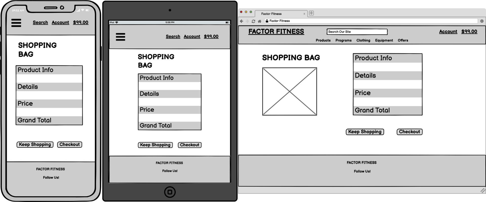

# FACTOR FITNESS


Visit the deployed site: [FACTOR FITNESS](https://factorfitness.herokuapp.com/) 

Factor Fitness is a fictional e-commerce store that specialises in strength training programs, gym equipment and apparel. 

This project was done as part of my Diploma by Code Institute in Full Stack Web Application Development. The objective for this milestone project was to plan, design and develop a project with all the functionalities to work as an actual e-commerce website.

At present the site is set up as a proof of concept, it allows users to create accounts, verify email addresses and place orders with a Stripe testing API checkout. 
Superusers are also able to log in and access the product management sections to add, delete or edit current products.

In its current form the site has many features missing that I would like to add in the future. I have detailed out these possible features later on in this README file.

---

## Contents 

* [User Experience](#User-Experience) 
* [User Stories](#User-Stories) 
* [Design](#Design) 
* [Colour Scheme](#Colour-Scheme) 
* [Typography](#Typography) 
* [Wireframes](#Wireframes) 
* [Database Schema](#Database-Schema)
* [Development Build Process](#Development-Build-Process)
* [Features](#Features) 
* [Pages](#Pages)
* [Future Development](#Future-Development) 
* [Accessibility](#Accessibility) 
* [Technologies Used](#Technologies-Used) 
* [Deployment](#Deployment)
* [How to Fork](#How-to-Fork) 
* [How to Clone](#How-to-Clone)
* [Testing](#Testing) 
* [Credits](#Credits)

---

## User Experience 

### User Stories 

#### First time Visitor Goals 

* I want the site to be clear so that I immediately know what the site is intended for upon entering.
* I want to be able to easily find and purchase products securely.
* I want the e-commerce store to work well on all kinds of devices like mobile phones, tablets and desktops.
* I want to easily navigate the site by using the navigation menu.
* I want and easy way to search and sort products that are relevant to me.
* I want to be able to securely purchase a product with feedback of where I am in the process and the current status of that purchase.
* I want the site to be visually appealing and easy to read.
* I want to be able to register as a returning user to save my details for future orders.
* I want to be able to get in contact via social media so that I can follow and contact the team.
* I want to be able to add a product to the shopping bag and view the total of the order.
* I want to view product details and images so I can see the product closer up and in more detail.
* I want to be able to update and delete products in the shopping bag to be in full control of the purchase.
* I want to view my order details to be able to confirm everything before final purchase.
* I want a clear indication of how to pay as well as an easy and secure method to pay for products with my card details.
* I want to receive appropriate feedback of the order success or failure to ensure the purchase has gone through.

#### Returning Visitor Goals

* To be able to log back into the site with my created username, email and password.
* To view my profile page to see my order history.
* To be able to log in and view, edit, add, delete my personal info.

#### Frequent Visitor Goals

* When clicking on social media links I want the page to open in a separate browser tab.
* I want to be able to easily and quickly see any new products or offers.

#### Admin User Goals

* I want to be able to view, search, edit and delete products.
* I want to be able to log into the product management section so I can add products to the database.

---

## Design

### Colour Scheme

I wanted to keep the colour scheme clean, simple and minimal to give a modern fitness gym like feel throughout. 

The backgrounds are kept to black and white to maintain a clean simple interface so that the users focus is mainly on the products on offer.

I used green as accent colours to contrast well against the white and grey backgrounds and card sections to give a pop of colour when wanting to get the users attention. 

The red was only used on the delete buttons and warnings so that these would stand out and that the user noticed them. 

I wanted to make sure that the contrast of the colours was very well defined throughout the site ensuring that the colour spectrum would work well for users with colour blindness.  

 
#

### Typography

Roboto font was used throughout the site as the base font.

This font works well for the site design as it is modern and easy to read. 


Bebas Neue font was used for the logo and for headings to give a bold impactful impression. 


Bebas Neue font as used for the main logo design. 


#

### Wireframes

Wireframes were created using Balsamiq software for desktop, mobile and tablet.





#

### Database Schema 


#

### Development Build Process

The build process of the site was completed in small incremental sections. 
This can be observed in the git commits catalogued within the Github repository that can be found here:
[Repository Commits](https://github.com/develosi/factor_fitness/commits/main)

Testing was carried out during the build, all testing documentation can be found at: [TESTING.md](TESTING.md)
#

### Features

The Website is made up of multiple applications, each with it's own content template page or multiple template pages. Each application uses content from the base template that includes the header and footer sections.

Toast messages are also used throughout the site to give the user important information when needed. 

* Home Page
* Sign Up Page
* Verify Your Email Page
* Confirm Your Email Address Page
* Login Page 
* Profile Page
* Products Page
* Product Details Page
* Shopping Bag Page 
* Checkout Page
* Checkout Success Page
* Add a Product Page 
* Edit a Product Page
* Product Edit and Delete Sections
* Log Out Confirmation Page
#

### Pages 

All Pages on the site are responsive and have a favicon of the FACTOR FITNESS FF Logo:

 

#### Base Template 

All pages throughout the website have these base template sections on them. The content for these sections is taken from the Base Template HTML page. 


#### Toast Messages

Toast messages are also used throughout the site. 


#### Home Page

The Home page welcomes new users to the site and what it offers.  

Users are immediately invited the shop section by clicking on the shop now button.


#### Sign Up Page

The user can register for an account. 


#### Verify Email Message Page

The user is informed to check their email to verify their account. 


#### Confirm Email Page

Once a user as gone to the verify email web link they are greeted with a message to click on the confirm email button. 


#### Log In Page 

The user can sign into their account. 


#### Profile Page

The user can access the profile page. 

The user can see any previous orders and add personal shipping details ready to be used on future orders. 


#### Products Page

The user can view current available products in the store and filter them using the dropdown menus at the top. 

Users can also serach the entire site for a particular product using the search bar at the top nav section.


#### Product Details Page

The user can see further details of a product on the details page. This includes pricing, review scores and category. 

Quantities of the product can be added or adjusted off and then the user can add to the shopping bag.  


#### Shopping Bag Page

The user can view all current selected products and adjust quantities if needed by changing the amount and clicking update. 

Users can also delete the product from the shopping bag by clicking on the delete button. 


#### Checkout Page

Users can see a summery of the products they have ordered and see the required input fields they need to complete for the shipping details. 

At the bottom of the shipping details section the user is invited to enter card details for payment. This is linked to the Stripe testing API.


#### Checkout Success Page

If the payment has successfuly gone through then the user is greeted with a thank you message and summery of their order. 

A conifirmation email will also be sent to the users email address. 


#### Add A Product Page

If the superuser 'admin' is logged in they can add products to the database using the product management section. 

The product management section is accessed through the 'My Account' dropdown menu.


#### Edit A Product Page

If the superuser 'admin' is logged in they can edit a product by clicking on the 'edit' button on any product page. 

The Edit A Product page allows a superuser to update all of the details relating to the product including the image used. 


#### Product Edit & Delete Section

If the superuser 'admin' is logged in they can edit or delete a product by clicking on the 'edit' or 'delete' buttons on any product page. 

Please note that no defensive programming has been set up yet for the deletion of products so superusers are given no warning before final deletion. 


#### Log Out Confirmation Page 

A user that is logged in can confirm they have logged out. 

For the purpose of this website I used the terminology of 'signed in' and 'signed out' as I felt it fitted the theme of the design user experience better. 


#### Future Development

In future development and implementations I would like to add the following:

* Fix the nav bar for mobile view so that the logo fits within the top nav section.
* Have a contact section where the user can contact the sales team with any questions or even have a live chat option.
* Add more products to the site as at the moment there is very few. 
* Update the product details page for mobile view as the current layout doesn't fit well on a small screen. 
* Add social media login options for users signing up for the first time so there is no need to use an email address. 
* Add a video background for the main home index page to add a more engaging design for new users. 
* Add more design to the emails that get sent out to users so the design fits the theme of the website.
* Add more features to the profile page so that a user can track delivery of shipments etc.
* Add the ability for users to change passwords and profile names, not just the shipping address.
* Give users the ability to review and give feedback scores to products within the profile section.
* Update shopping bag layout for mobile view as it currently doesn't fit well on small screens.  
* Show that the payments are processed by Stripe with branding at checkout to give confidence to the user paying it will be secure.
* Add more features to the product management section as at present only new products can be added on this page. 
* Add more defensive programming throughout the site such as when superusers can delete products on the products page.
#

### Accessibility

I have been mindful to ensure that the site is as accessible as possible. The areas I have focused on:

* Using semantic HTML with alt and aria attributes as much as possible.
* Using wording rather than an icon when an important action is required on a button.
* Choosing a simple easy to read font for the site with a bold style.
* Ensuring that there is a strong colour contrast throughout the site so it easy to read.
* Extensive A11y and colour blindness accessibility testing carried out, results of all testing can be found at: [TESTING.md](TESTING.md).
#

### Defensive Programming

I would like to have spent more time developing the defensive programming features throughout the site. 
At present when a superuser wants to delete a product no warning alert appears for them to double confirm they are sure they want to delete it. 

At present whenever there is an important action to be completed by a user I have coloured it in red and made as bold as possible. 

In the future I hope to develop out the site further and add more defensive programming features throughout. 

---

## Technologies Used

### Languages Used

HTML, CSS, Javascript, Python

### Frameworks, Libraries & Programs Used

* [PostgreSQL](https://www.postgresql.org/) - Relational database used.

* [Django](https://www.djangoproject.com/) - Open-source web framework, used as the main framework for the site.

* [MaterializeCSS](https://materializecss.com/) - CSS Framework.

* [SQLAlchemy](https://pypi.org/project/SQLAlchemy/) - Database library, used to interact with PostgreSQL.

* [Pip](https://pypi.org/project/pip/) - Tool for installing python packages.

* [Jinja](https://jinja.palletsprojects.com/en/3.1.x/) - Web template engine.

* [Balsamiq](https://balsamiq.com/) - Used to create wireframes.

* [Github](https://github.com/) - For version control, save and store the files and deployment of site.

* [Visual Studio Code](https://code.visualstudio.com/) - Integrated development environment.

* [Font Awesome](https://fontawesome.com/) - For the icons on the app.

* [Google Chrome Dev Tools](https://developer.chrome.com/docs/devtools/) - Testing features, checking responsiveness and styling.

* [Tiny PNG](https://tinypng.com/) To compress images.

* [Canva](https://www.canva.com/) To resize images and create the logo.

* [Favicon.io](https://favicon.io/) To create the favicon.

* [Am I Responsive?](http://ami.responsivedesign.is/) - To show the website run on a range of devices.

* [Techsini](https://techsini.com/multi-mockup/index.php) - Used to create mock up images of site on devices.

* [Coolers](https://coolors.co/) - Colour scheme creation tool.

* [Web Disability Simulator](https://chrome.google.com/webstore/detail/web-disability-simulator/olioanlbgbpmdlgjnnampnnlohigkjla?hl=en) - A Google chrome extension to help check for accessibility issues.

---

## Deployment & Local Development

### Deployment

The site is deployed using Heroku. To deploy to Heroku:

1. To successfully deploy on Heroku we first need to create some files: a requirements.txt file and a Procfile.

2. The requirements.txt file contains all the applications and dependencies that are required to run the app. To create the requirements.txt file run the following command in the terminal:

    ```bash
    pip3 freeze --local > requirements.txt
    ```

3. The Procfile tells Heroku which files run the app and how to run it. To create the Procfile run the following command in the terminal:

    ```bash
    echo web: python app.py > Procfile
    ```

    NOTE: The Procfile uses a capital P and doesn't have a file extension on the end.

4. If the Procfile has been created correctly it will have the Heroku logo next to it. It is also important to check the Procfile contents, as sometimes on creation a blank line will be added at the end of the file. This can sometimes cause problems when deploying to Heroku, so if the file contains a blank line at the end, delete this and save the file. Make sure to save both these files and then add, commit and push them to GitHub.

5. Login (or sign up) to [heroku.com](https://www.heroku.com).

6. Click the new button and then click create new app.

7. You will then be asked to give your app a name (these must be unique so you cannot reuse the same as someone else) and select a region, the region should be the one closest to you. Once these are completed click create app.

8. You will now need to connect the Heroku app to the GitHub repository for the site. Select GitHub in the deployment section, find the correct repository for the project and then click connect.

9. Once the repository is connected, you will need to provide Heroku some config variables it needs to build the app. Click on the settings tab and then click reveal config vars button. You will now need to add the environment key/value variables that were used in the env.py file:

    | KEY | VALUE |
    | :-- | :-- |
    | IP | 0.0.0.0 |
    | PORT | 5000 |
    | SECRET_KEY| YOUR_SECRET_KEY* |
    | DATABASE_URL | POSTGRES://* |
    | DEBUG | TRUE** |

    *Denotes a value that is specific to your app.

    **This is set to true while deploying to enable us to see any bugs. Please change to FALSE after deployment.

10. You're now ready to click the 'enable automatic deploys' and create button. Heroku will start building the app.

11. As this project utilises a relational database, there are a few more steps to set this up.

12. On the heroku dashboard go to resources tab and then select add-ons. You will need to search for and select heroku postgres. For this project the hobby dev free tier is fine.

13. Go back into settings and reveal config vars. You should now see a new key called DATABASE_URL and the value should have been pre-populated.

14. We will now need to go the more button on the dashboard and select run console. This is where we will set up the tables in the database we have just created.

15. Type python3 and then once the python interpretor opens, we can run the following:

    ```bash
    from factor_fitness import db
    db.create_all()
    exit()
    ```

16. Now that the relational database has been set up and the tables created, we can now click open app and the Debugist application should now open in a new tab.
#

### Local Development

#### How to Fork

To fork the repository:

1. Log in (or sign up) to Github.

2. Go to the repository for this project, [Factor Fitness](https://github.com/develosi/factor_fitness).

3. Click the Fork button in the top right corner.

#### How to Clone

To clone the repository:

1. Log in (or sign up) to GitHub.

2. Go to the repository for this project, [Factor Fitness](https://github.com/develosi/factor_fitness).

3. Click on the code button, select whether you would like to clone with HTTPS, SSH or GitHub CLI and copy the link shown.

4. Open the terminal in your code editor and change the current working directory to the location you want to use for the cloned directory.

5. Type the following command in the terminal (after the git clone you will need to paste the link you copied in step 3 above):

    ```bash
    git clone { & THE LINK FROM STEP 3 }
    ```

6. Install the packages from the requirements.txt file by running the following command in the Terminal:

    ```bash
    pip3 install -r requirements.txt
    ```
#

## Testing

Please refer to [TESTING.md](TESTING.md) file for all testing completed.
#

## Credits

### Code Used

I used the code from the Code Institute modules on the Boutique Ado project as a starting point for the main structure of the website. 

### Content

All content for the app, such as instructions and modal messages were written by myself.
For proof of concept some dummy content has already been created such as projects and outstanding tasks, this was written by myself.

### Media

Logo was designed by myself using Canva design tools and is copyright free.

### Acknowledgments

I would like to acknowledge the following people:

* My Code Institute Mentor and Class Teacher 

* My fellow class-mates  - For sharing all their struggles and accomplishments along the way with tackling Milestone project 4.

* The Code Institute Slack channel - Thanks to everyone that took the time to share their tips and advice.
#