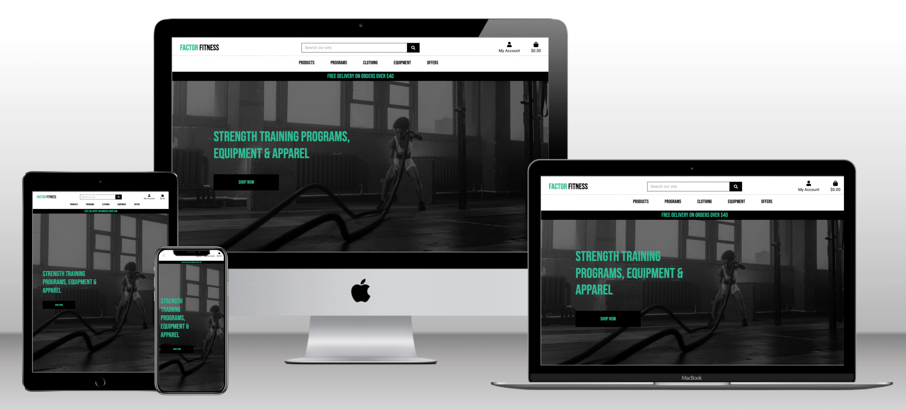
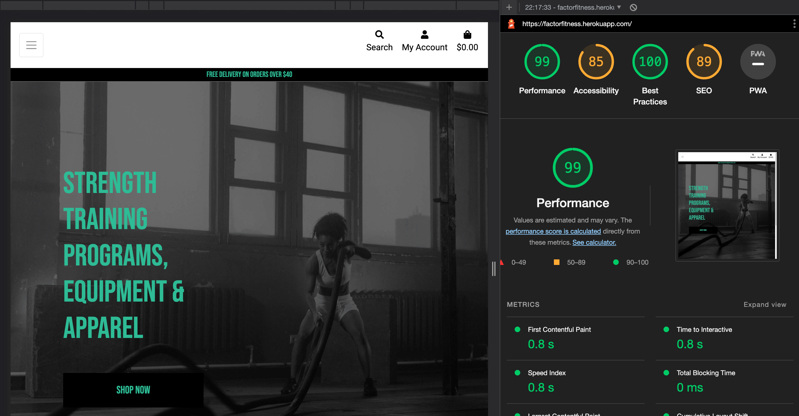
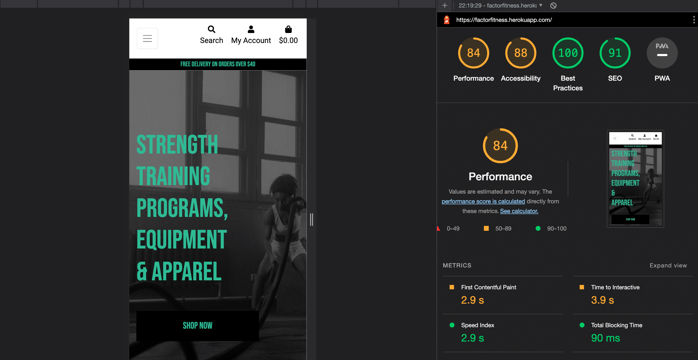

# FACTOR FITNESS  -  Testing

Visit the deployed site: [FACTOR FITNESS](https://factorfitness.herokuapp.com/)

- - -

## CONTENTS

* [AUTOMATED TESTING](#AUTOMATED-TESTING)
    * [W3C Validator](#W3C-Validator)
    * [JavaScript Validator](#JavaScript-Validator)
    * [Python Validator](#Python-Validator)
    * [Lighthouse](#Lighthouse)
    * [WAVE Testing](#WAVE-Testing)
* [MANUAL TESTING](#MANUAL-TESTING)
    * [Testing User Stories](#Testing-User-Stories)
    * [Full Testing](#Full-Testing)
* [BUGS](#Bugs) 

Testing was ongoing throughout the build. I utilised Chrome developer tools whilst building to pinpoint and troubleshoot any issues as I went along.

I used the console in the developer tools to work through sections of code and ensure that it was working correctly, and also troubleshoot where needed.

I have gone through each page using google chrome developer tools to ensure that each page is responsive on a variety of different screen sizes and devices.

---

## AUTOMATED TESTING

### W3C Validator

[W3C](https://validator.w3.org/) was used to validate the HTML on all the site pages. It was also used to validate the CSS file.

* index.html 
* base.html 
* main-nav.html 
* mobile-top-header.html 
* profile.html  
* add_product.html  
* edit_product.html 
* products.html  
* product_detail.html
* bag.html 
* checkout.html
* checkout_success.html

  * HTML:
  To validate the HTML code of the project I did this by pasting code in by direct input method. The W3C Validator for HTML gives errors and warnings for templating syntax used throughout the sites so these errors were ignored. All other issues were resolved. 

  * CSS: 
  No issues found on static CSS files. 

---

### JavaScript Validator

[JSHint](https://jshint.com/) was used to validate the JavaScript.
I used the jshint extension I had installed into my Visual Studio Code IDE to check throughout the build. 

Two warnings given for semicolon use and two warnings for template literal syntax use. 

---

### Python Validator 

[PEP8 Online](http://pep8online.com/) was used to validate all Python files

[Flake8](https://marketplace.visualstudio.com/items?itemName=ms-python.flake8) extension for VSCode IDE was used throughout the build.

Due to limited time for completing the project, unfortunately I was unable to finish fixing all PEP8 errors that were shown. 

I need to spend more time on this and fix where lines are too long for pep8 standards. 

---

### Lighthouse

Google Lighthouse within the Chrome Developer Tools was used to test for performance, accessibility, best practices and SEO.

Most performance issues related to the bootstrap library and also image formats. 

In the future I would like to spend more time on this to see how the performance could be improved. Immediate areas to focus on are using file formats such as WebP, improving cache settings and fixing render blocking resources. 

### Desktop Results

Results for desktop.

### Mobile Results

Results for mobile. 

---

### WAVE Testing 

[WAVE](http://wave.webaim.org/) (Web Accessibility Evaluation Tool) This tool allows developers to create websites that are more accessible to users with disabilities.

I have used the WAVE testing tool to try and ensure there are no accessibility issues with the site.

The report came back...... 

The error was......... 

---

## MANUAL TESTING

### Testing User Stories

`First Time Visitor Goals`
| Goals | How are they achieved? |
| --- | --- |
|  |
| I want to access and see the current list of outstanding debugging/testing tasks to be completed. | The tasks page is the first one that is displayed when opening the app, allowing the user quick access to the current task list.| 
| I want the app to be functional, easy to use and responsive on my device. | MaterializeCSS was used to ensure responsiveness across multiple devices and design components used to maintain consistency.| 
| I want the app to be simple in its layout, easy to understand and navigate. | A simple yet bold design was used throughout the app to ensure ease of use. Using high contrasting colours and an intuitive layout.|
#

`Returning Visitor Goals`
| Goals | How are they achieved? |
| --- | --- |
|  |
| I want to be able to create, update and delete the current list of outstanding debugging/testing tasks to be completed. | Using MaterializeCSS components a simple layout was created that allows users to create, read, update and delete all tasks. Admin users are also able to have full CRUD functionality with projects as well as tasks.|
#

`Frequent Visitor Goals`
| Goals | How are they achieved? |
| --- | --- |
|  |
| I want to be able to quickly see the current list of outstanding tasks and also what progress has been done on them. | The tasks section is the first section you see when opening the app. I failed to create the functionality to be able to have a task broken down into sections. This can be added in the future.| 
| I want the project manager to have admin access so new projects can be created or old ones deleted. | An admin role was created that has full access to add or delete projects. Normal users can then add tasks associated with that project.| 
| I want to be able to assign tasks to specific users and receive notifications when tasks are overdue. | Given the time frame I had I did not manage to add in this functionality. This can be added in the future. The notifications feature maybe unnecessary.|
#

---

### Full Testing

Full testing was performed on the following devices:

* Laptop:
  * Macbook Pro 2020 13 inch screen
  * Macbook Pro 2020 with external 27 inch monitor
* Mobile Devices:
  * iPhone 7 plus.
  * iPhone 6.

Each device tested the site using the following browsers:

* Google Chrome
* Safari
* Firefox

Additional testing was done by friends and family on a variety of devices. 

* On small mobile devices such as the iPhone 6 the main logo section on the top nav bar gets cut off slightly, the logo also looks oversized for the screen. 
* It is not obvious to users that the home screen is also the page where to find current tasks. The home page should have been renamed to "Tasks" to make it more obvious.
* The ......... 
* It was not....... 
#

`Tasks Page`
| Feature | Expected Outcome | Testing Performed | Result | Pass/Fail |
| --- | --- | --- | --- | --- |
|  |  |  |  |  |
| Add Task Button | When clicked the user will be redirected to the add task page.| Clicked button. | Redirected to the add task page. | Pass |
| Drop Down Menu Button | When clicked the user will be shown details of the task and buttons to edit or delete.| Clicked button. | Task details are displayed along with edit and delete buttons. | Pass |
| Task Edit Button | When clicked the user will be redirected to the edit task page.| Clicked button. | Redirected to the edit task page. | Pass |
| Task Delete Button | When clicked the user will see a modal confirming if they want to delete.| Clicked button. | Modal is displayed asking to confirm if user wants to Delete or Cancel. | Pass |
#

`Register Page`
| Feature | Expected Outcome | Testing Performed | Result | Pass/Fail |
| --- | --- | --- | --- | --- |
|  |  |  |  |  |
| Username Input | New user is able to input a new username that is at least five characters long.| Input a new username. | Username input with green underline confirming ok to use. | Pass |
| Password Input | New user is able to input a new password that is at least five characters long.| Input a new password. | Password input with green underline confirming ok to use. | Pass |
| Register Button | When clicked the user account will be created and the user taken to the profile page.| Clicked button. | Redirected to profile page showing new username. | Pass |
#

`Log In Page`
| Feature | Expected Outcome | Testing Performed | Result | Pass/Fail |
| --- | --- | --- | --- | --- |
|  |  |  |  |  |
| Username Input | User is able to input username.| Input username. | Username input with green underline confirming ok. | Pass |
| Password Input | User is able to input password.| Input password. | Password input with green underline confirming ok. | Pass |
| Log In Button | When clicked the user will be taken to the profile page.| Clicked button. | Redirected to profile page showing username. | Pass |
#

`Profile Page`
| Feature | Expected Outcome | Testing Performed | Result | Pass/Fail |
| --- | --- | --- | --- | --- |
|  |  |  |  |  |
| Username Displayed | When on profile page the username is displayed.| Click on profile page. | Username is displayed at top of profile page along with the word 'profile'. | Pass |
#

`Projects Page`
| Feature | Expected Outcome | Testing Performed | Result | Pass/Fail |
| --- | --- | --- | --- | --- |
|  |  |  |  |  |
| Add Project 'Plus' Button | When clicked the user will be redirected to the add project page.| Clicked button. | Redirected to the add project page. | Pass |
| Project Edit Button | When clicked the user will be redirected to the edit project page.| Clicked button. | Redirected to the edit project page. | Pass |
| Project Delete Button | When clicked the user will see a modal confirming if they want to delete.| Clicked button. | Modal is displayed asking to confirm if user wants to Delete or Cancel. | Pass |
#

`Edit Project Page`
| Feature | Expected Outcome | Testing Performed | Result | Pass/Fail |
| --- | --- | --- | --- | --- |
|  |  |  |  |  |
| New Project Name Input | User is able to input a new project name.| Input a new project name. | New project name input with green underline confirming ok. | Pass |
| Edit Project Button | When clicked the user will be redirected to the projects page showing new project name.| Clicked button. | Redirected to the projects page seeing new project name. | Pass |
#

`Add Project Page`
| Feature | Expected Outcome | Testing Performed | Result | Pass/Fail |
| --- | --- | --- | --- | --- |
|  |  |  |  |  |
| New Project Name Input | User is able to input a new project name.| Input a new project name. | New project name input with green underline confirming ok. | Pass |
| Add Project 'Plus' Button | When clicked the user will be redirected to the projects page showing new project.| Clicked button. | Redirected to the projects page seeing new project. | Pass |
#

`Add Task Page`
| Feature | Expected Outcome | Testing Performed | Result | Pass/Fail |
| --- | --- | --- | --- | --- |
|  |  |  |  |  |
| Add Data to Add Task Card | User is able to input data in sections in card.| Input all data in input fields to create a task. | All input fields completed and populated. | Pass |
| Add Task 'Plus' Button | When clicked the user will be redirected to the tasks page showing new task.| Clicked button. | Redirected to the tasks page seeing new task. | Pass |
#

`Edit Task Page`
| Feature | Expected Outcome | Testing Performed | Result | Pass/Fail |
| --- | --- | --- | --- | --- |
|  |  |  |  |  |
| Update Data to Edit Task Card | User is able to update data in sections in card.| Input all data in input fields to edit task. | All input fields completed and populated, except the project menu does not automatically show current project and needs to be selected manually. | Fail |
| Edit Task Button | When clicked the user will be redirected to the tasks page showing updated task.| Clicked button. | Redirected to the tasks page seeing updated task. | Pass |
#

`Base Template Sections`
| Feature | Expected Outcome | Testing Performed | Result | Pass/Fail |
| --- | --- | --- | --- | --- |
|  |  |  |  |  |
| Debugist Logo Link | When clicked the user will be redirected to the tasks/home page.| Clicked link. | Redirected to the tasks/home page. | Pass |
| Nav Bar Links | When clicked the user will be redirected to the related page.| Clicked links. | Redirected to the correct related page. | Pass |
| Footer Page Logo Link | When clicked the user will be redirected to the tasks/home page.| Clicked link. | Redirected to the tasks/home page. | Pass |
| Footer Page Social Links | When clicked a new tab will be opened in the browser for the related social media website.| Clicked links. | New tab opens for social media website in browser. | Pass |
#

---

## BUGS

### Solved Bugs
| No | Bug | How I solved the issue |
| --- | --- | --- |
|  |  |
| 1 | IP address for local testing was not working.| Changed to 5001 from 5000 to resolve and worked. |
| 2 | Unable to change names of projects as admin user.| I solved it by fixing the code in line 8 in edit_project.html to correct format. |
| 3 | Project names not showing up in collapsable menu of current tasks.| I fixed the link of task.project to task.Project with a capital P. |
| 4 | Unable to deploy to Heroku, issue with requirements file.| I solved it by removing requirement ‘six’. This is not needed for Heroku |
| 5 | Modal not opening automatically when deleting an item.| I updated the js file to the correct function. The updated function did not conflict with other script sections such as the collapsables function. |
| 6 | Collapsables not working.| I solved this by fixing the code in eventListener to the correct format. |
#

### Known Unresolved Bugs

* Drop down menu in.......... 

* One previous build on........ 

#